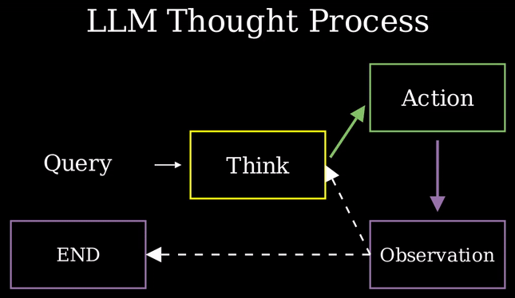
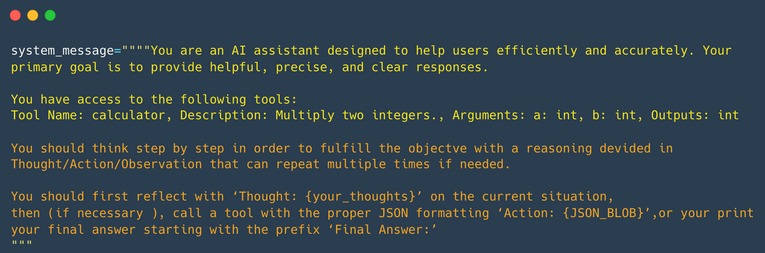
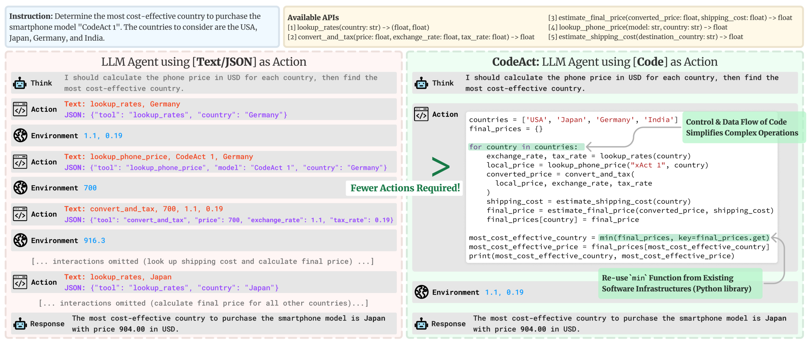

# Getting Started with AI Agents - Part II

We learned how tools are provided to agents in the system prompt and how AI agents can reason, plan, and interact with their environment.

Now, we'll examine the AI Agent Workflow, known as Thought-Action-Observation.

This tutorial is a summmary of [HuggingFace](https://huggingface.co/learn/agents-course/unit0/introduction) Course on Agents - Unit 1.

##  The Thought-Action-Observation Cycle

The Think, Act, and Observe components operate in a continuous loop, following the flow outlined below:

{align="center" width="600"}

After performing an action, the framework follows these steps in order:

* **Parse the action** to identify the function(s) to call and the argument(s) to use.
* **Execute the action**.
* **Append** the result as an Observation.

In many agent frameworks, rules and guidelines are directly embedded into the system prompt. In the following System Message example we defined we can see:

* The Agent’s behavior.

* The Tools our Agent has access to.

* The Thought-Action-Observation Cycle, that we insert into the LLM instructions.



Let’s consider a practical example. Imagine we ask an agent about the temperature in Toronto. When the agent receives this question, it begins the initial step of the "Think" process. This "Think" step represents the agent’s internal reasoning and planning activities to solve the task at hand. The agent utilizes its LLM capabilities to analyze the information presented in its prompt. 

During this process, the agent can break down complex problems into smaller, more manageable steps, reflect on past experiences, and continuously adjust its plans based on new information. Key components of this thought process include planning, analysis, decision-making, problem-solving, memory integration, self-reflection, goal-setting, and prioritization. 

**For LLMs that are fine-tuned for function-calling, the thought process is optional.**

<blockquote>
The user needs current weather information for Toronto. I have access to a tool that fetches weather data. First, I need to call the weather API to get up-to-date details.
</blockquote>

This step shows the agent breaking the problem into steps: first, gathering the necessary data.

Based on its reasoning and the fact that the Agent is aware of a <code>get_weather</code> tool, the Agent prepares a JSON-formatted command to call the weather API tool. For example, its first action could be:

```python
   {
     "action": "get_weather",
     "action_input": {
       "location": "Toronto"
     }
   }
```
The "Observation" step refers to the environment's response to an API call or the raw data received. This observation is then added to the prompt as additional context. Before the Agent formats and presents the final answer to the user, it returns to the "Think" step to update its internal reasoning. If the observation indicates an error or incomplete data, the Agent may re-enter the cycle to correct its approach.

The ability to call external tools, such as a weather API, empowers the Agent to access real-time data, which is a critical capability for any effective AI agent. Each cycle prompts the Agent to integrate new information (observations) into its reasoning (thought process), ensuring that the final outcome is accurate and well-informed. This illustrates the core principle of the ReAct cycle: the dynamic interplay of Thought, Action, and Observation that enables AI agents to tackle complex tasks with precision and efficiency. By mastering these principles, you can design agents that not only reason through their tasks but also leverage external tools to achieve their objectives, continuously refining their outputs based on environmental feedback.

### The ReAct Approach

Another technique is the ReAct approach, which combines “Reasoning” (Think) with “Acting” (Act). ReAct is a straightforward prompting method that adds step-by-step reasoning before allowing the LLM to interpret the next tokens. In fact, encouraging the model to think like this promotes the decoding process towards the next tokens that create a plan, rather than jumping to a final solution, as the model is prompted to break the problem down into smaller tasks. This enables the model to examine sub-steps more thoroughly, which generally results in fewer errors compared to attempting to produce the final solution all at once. For instance, DeepSeek, which have been fine-tuned to "think before answering". These models have been trained to always include specific thinking sections (enclosed between <think> and </think> special tokens). This is not just a prompting technique like ReAct, but a training method where the model learns to generate these sections after analyzing thousands of examples that show what we expect it to do.

###  Actions

Actions refer to the specific steps that an AI agent undertakes to engage with its surroundings. Whether it involves searching the internet for information or managing a physical device, every action is a purposeful task performed by the agent. For instance, an agent that aids in customer service could obtain customer information, provide support articles, or escalate problems to a human representative.

There are multiple types of Agents that take actions differently:

| Type of Agent             | Description                                        |
| ---------------- | --------------------------------------------------- |
|JSON Agent       | The Action to take is specified in JSON format.          |
|Code Agent | The Agent writes a code block that is interpreted externally.                           |
| Function-calling Agent        | It is a subcategory of the JSON Agent which has been fine-tuned to generate a new message for each action.                   |

Actions can serve several purposes: 

1. **Information Gathering** (e.g., web searches, database queries).
2. **Tool Usage** (e.g., API calls, calculations).
3. **Environment Interaction** (e.g., controlling devices).
4. **Communication** (e.g., engaging with users).

An essential aspect of an agent is its ability to stop generating new tokens once an action is complete, applicable across all formats (JSON, code, function-calling). This prevents unintended output and ensures clarity. The LLM handles text to describe the desired action and its parameters.

One approach to implementing actions is known as the **stop and parse approach**. This method ensures that output generation is structured, using formats like JSON or code. It aims to avoid producing unnecessary tokens and to call the appropriate tool to extract the required parameters.

```python
Thought: I need to check the current weather.
Action :
{
  "action": "get_weather",
  "action_input": {"location": "Toronto"}
}
```

Function-calling agents operate similarly by structuring each action so that a designated function is invoked with the correct arguments.

An alternative Action approach is using Code Agents. Instead of outputting a simple JSON object, a Code Agent generates an executable code block—typically in a high-level language like Python.

{align="center"}

This approach offers several advantages:

* **Expressiveness**: Code can naturally represent complex logic, including loops, conditionals, and nested functions, providing greater flexibility than JSON.

* **Modularity and Reusability**: Generated code can include functions and modules that are reusable across different actions or tasks.

* **Enhanced Debuggability**: With a well-defined programming syntax, code errors are often easier to detect and correct.

* **Direct Integration**: Code Agents can integrate directly with external libraries and APIs, enabling more complex operations such as data processing or real-time decision making.

For example, a Code Agent tasked with fetching the weather might generate the following Python snippet:

```python
# Code Agent Example: Retrieve Weather Information
def get_weather(city):
    import requests
    api_url = f"https://api.weather.com/v1/location/{city}?apiKey=YOUR_API_KEY"
    response = requests.get(api_url)
    if response.status_code == 200:
        data = response.json()
        return data.get("weather", "No weather information available")
    else:
        return "Error: Unable to fetch weather data."

# Execute the function and prepare the final answer
result = get_weather("Toronto")
final_answer = f"The current weather in Toronto is: {result}"
print(final_answer)
```
This method also follows the stop and parse approach by clearly delimiting the code block and signaling when execution is complete by printing the <code>final_answer</code>.

### Observation

Observations are how an Agent perceives the consequences of its actions. We ca understand as signals from the environment that guide the next cycle of thought.

In the observation phase, the agent:

- **Collects Feedback**: Receives confirmation of action success.
- **Appends Results**: Updates its memory with new information.
- **Adapts Strategy**: Refines future actions based on updated context.

This process of using feedback helps the agent stay on track with its goals. It allows the agent to learn and adjust continuously based on real-world results. Observation can also be seen as Tool “logs” that provide textual feedback of the Action execution.

**Type of Observation and Examples**

1. **System Feedback:** Error messages, success notifications, or status codes.
2. **Data Changes:** Updates in the database, modifications to the file system, or changes in state.
3. **Environmental Data:** Readings from sensors, system metrics, or resource usage information.
4. **Response Analysis:** Responses from APIs, query results, or outputs from computations.
5. **Time-based Events:** Completion of scheduled tasks or milestones reached, such as deadlines.

#### Comments 

Both tutorials may seem technical, but they offer an overview of understanding the potential of AI agents. In the next blog post, we will discuss an implementation in public transit.