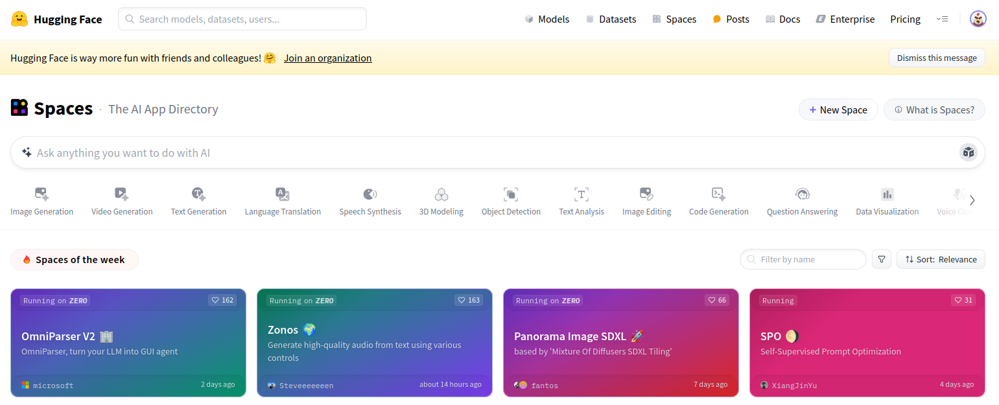
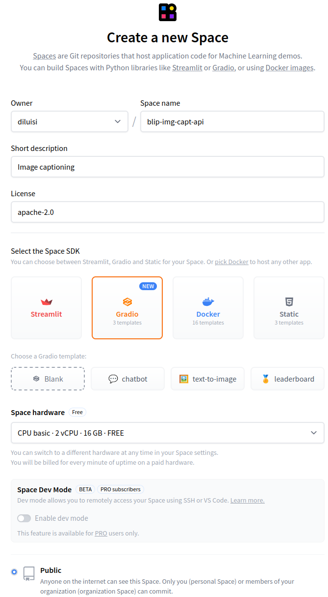
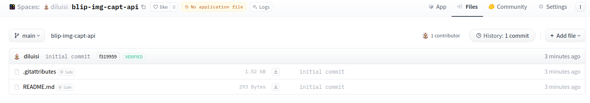
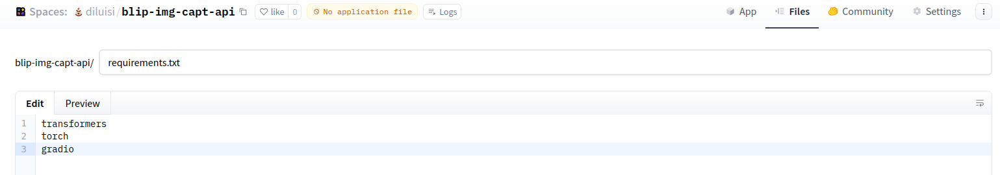
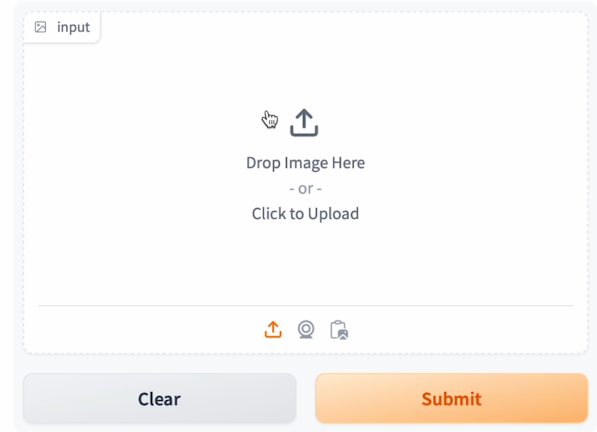
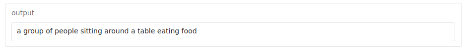
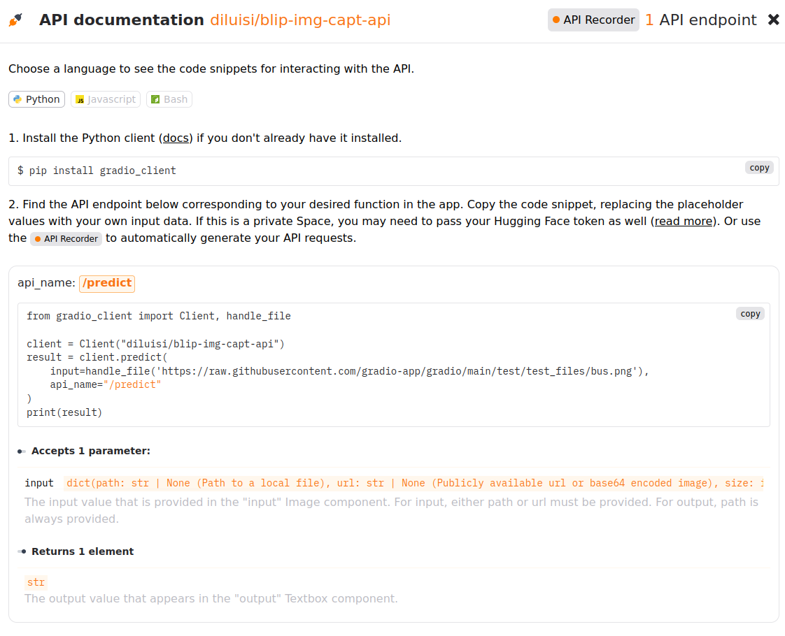

# Deploy Machine Learning Models on HuggingFace Hub using Gradio?

In this tutorial, we will learn how to deploy models to Hugging Face Spaces. Hugging Face Spaces is a platform designed to create, share, and deploy machine learning (ML) demo applications, like an API (you can also call your app).

Each Spaces environment is limited to 16 GB of RAM, 2 CPU cores, and 50 GB of non-persistent disk space by default, which is available free of charge. If you require more resources, you have the option to upgrade to better hardware.

The first step is to create an account at the [HuggingFace website](https://huggingface.co/).



Next, we will create a new space by clicking on the upper bar "Spaces" and the button +New Space. Next, we will create a new space by clicking on the upper bar and the button +New Space. We can select the "Free" version for the space hardware and set it up as a "Public" space.

As you can see, we selected Gradio as our web tool.



This is the result after creating the space:



We still need to add two files to our project: <code>app.py</code> and <code>requirements.txt</code>.

Let's create the requirements first:



After creating the "requirements.txt" file, the next step is to create an "app.py" file. To do this, we will copy the code below and paste it into a new file.

```python
import gradio as gr
from transformers import pipeline

# load the image-text pipeline with Blip architecture
pipe = pipeline("image-to-text",
                model="Salesforce/blip-image-captioning-base")

# this function receives the input, call the pipeline
# and get the generated text from the output
def launch(input):
    out = pipe(input)
    return out[0]['generated_text']

# gradio interface, input is an image and output text
iface = gr.Interface(launch,
                     inputs=gr.Image(type='pil'),
                     outputs="text")

# if you want to share the link set "share=True"
iface.launch()
```
Once you commit your files and click on the App tab, Space will automatically load the required files and interface. After you finish running the files, you will see the screen below, which serves as our interface for interacting with the app.

{width="400"}

Time to test our solution!

{width="800"}
{width="800"}

At the bottom of your app screen, you can click "Use via API" to see sample code that you can use to use your model with an API call.



To run the program locally, copy and paste the code snippet onto your machine and execute the file. Remember to specify the path to the input and to call the API using the endpoint "/predict".

If you wish to keep your API private, you must pass your TOKEN to make the call.


## **References**

This tutorial is based on the course "DeepLearning.AI-Open Source Models with Hugging Face."